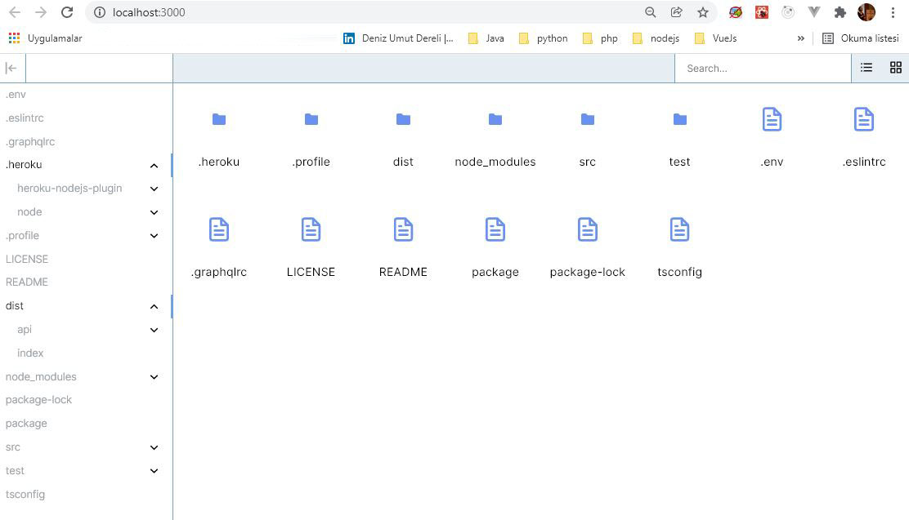
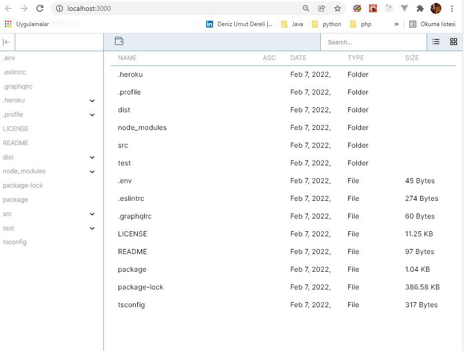

# React Graphql File Browsing Client Application

This is a simple demo purpose client application that can input the directory to be read and display the results from one of other <a href="https://github.com/denizumutdereli/node-graphql-typescript-file-browsing">Node Apollo Server with Graphql</a> repo.

> npm install

> npm start

* File browsing fixed to max as depth to root foolder.
* Apollo cache fragments are in charge.
* File previews and mutations are minimized
* Docker minimum configuration added.

### Screenshots

